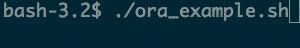

## Bash terminal spinner
Ora.sh is a dependency-free elegant terminal spinner.



### Example

```sh
source ora.sh

task_1() {
  sleep 2
  echo "ora.sh is"
}

task_2() {
  sleep 2
  echo "awesome"
}

stty -echo && tput civis

spinner "Task 1" task_1 output1
spinner "Task 2" task_2 output2
tput el

echo "Task 1's output: $output1"
echo "Task 2's output: $output2"
tput cnorm && stty echo

```
